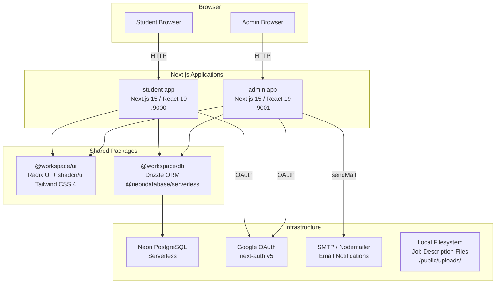

# NextPlacement


> A college placement management platform with a student-facing job portal and an admin dashboard for managing companies, job listings, and applications.

---

## Table of Contents

- [What is this Project?](#what-is-this-project)
- [Architecture Overview](#architecture-overview)
- [Tech Stack](#tech-stack)
- [Project Structure](#project-structure)
- [Quick Start](#quick-start)
- [API Reference Summary](#api-reference-summary)
- [Environment Variables](#environment-variables)
- [Development Tools](#development-tools)
- [Contributing](#contributing)
- [License](#license)

---

## What is this Project?

NextPlacement is a full-stack monorepo placement management system designed for engineering colleges. Students can register, build their profiles with academic records, and apply to active job listings with their uploaded resumes. Admins manage the full lifecycle: creating company and job records, uploading job description files (PDF/text), setting eligibility criteria (CGPA, SSC/HSC, KT policy), and updating application statuses. Authentication for both surfaces is handled by NextAuth v5 with Google OAuth. The two Next.js apps share a common UI component library and a Drizzle ORM + Neon PostgreSQL data layer via a shared workspace package.

---

## Architecture Overview



---

## Tech Stack

### Services

| Service   | Language   | Runtime      | Framework               | Database                    | Role                      | Port |
| --------- | ---------- | ------------ | ----------------------- | --------------------------- | ------------------------- | ---- |
| `student` | TypeScript | Node.js ≥ 20 | Next.js 15 (App Router) | Neon PostgreSQL via Drizzle | Student-facing job portal | 9000 |
| `admin`   | TypeScript | Node.js ≥ 20 | Next.js 15 (App Router) | Neon PostgreSQL via Drizzle | Admin dashboard           | 9001 |

### Infrastructure

| Component        | Technology                            | Purpose                                       |
| ---------------- | ------------------------------------- | --------------------------------------------- |
| Database         | Neon PostgreSQL (serverless)          | Primary data store                            |
| ORM              | Drizzle ORM + drizzle-zod             | Type-safe queries and schema validation       |
| Auth             | NextAuth v5 (beta) + Google OAuth     | Session management for both apps              |
| Email            | Nodemailer (pooled SMTP)              | Application status notifications              |
| File storage     | Local filesystem (`/public/uploads/`) | Job description PDFs and text files           |
| Monorepo tooling | Turborepo + pnpm workspaces           | Build orchestration and dependency management |
| UI primitives    | Radix UI + shadcn/ui + Tailwind CSS 4 | Shared component library                      |
| Tables           | TanStack Table v8                     | Data grids in both apps                       |
| Forms            | React Hook Form + Zod                 | Validated form handling                       |
| Animations       | Framer Motion                         | UI transitions                                |

---

## Project Structure

```
nextplacement/
├── apps/
│   ├── admin/                   # Admin dashboard (Next.js, port 9001)
│   │   ├── app/
│   │   │   ├── (main)/          # Authenticated admin routes
│   │   │   │   ├── jobs/        # Job CRUD (list, [jobId], new)
│   │   │   │   └── students/    # Student management with data table
│   │   │   ├── api/
│   │   │   │   ├── applications/[applicationId]/status/  # PATCH application status
│   │   │   │   ├── auth/        # NextAuth route handler
│   │   │   │   ├── files/job-descriptions/[filename]/    # Serve uploaded files
│   │   │   │   └── health/      # Health check (DB + SMTP)
│   │   │   └── login/           # Google OAuth sign-in page
│   │   ├── lib/
│   │   │   ├── mailer.ts        # Singleton Nodemailer transporter
│   │   │   └── mail-templates.ts # Email HTML templates
│   │   └── auth.ts              # NextAuth config (ADMIN role gate)
│   │
│   └── student/                 # Student portal (Next.js, port 9000)
│       ├── app/
│       │   ├── (main)/          # Authenticated student routes
│       │   │   ├── jobs/        # Job listings
│       │   │   ├── applications/# Application history
│       │   │   └── profile/     # Student profile editor
│       │   ├── api/
│       │   │   ├── auth/        # NextAuth route handler
│       │   │   ├── files/job-descriptions/[filename]/  # Serve uploaded files
│       │   │   └── health/      # Health check
│       │   ├── login/           # Google OAuth sign-in page
│       │   └── signup/          # New student registration
│       └── auth.ts              # NextAuth config (USER role gate)
│
├── packages/
│   ├── db/                      # Shared database package
│   │   ├── schema.ts            # Drizzle table definitions (students, jobs, companies, applications, …)
│   │   ├── drizzle.ts           # Neon HTTP client + Drizzle instance
│   │   ├── index.ts             # Re-exports schema + db
│   │   ├── drizzle.config.ts    # Drizzle Kit config
│   │   └── migrations/          # SQL migration files
│   ├── ui/                      # Shared shadcn/ui component library
│   ├── eslint-config/           # Shared ESLint configs
│   └── typescript-config/       # Shared tsconfig bases
│
├── docker-compose.yml           # Production: student (:9000) + admin (:9001)
├── docker-compose.dev.yml       # Development: apps + local Postgres (:5432)
├── .env                         # Runtime env vars
├── docker.env                   # Runtime env vars for Docker (not committed in production)
├── turbo.json                   # Turborepo task pipeline
└── pnpm-workspace.yaml          # Workspace package paths
```

---

## Quick Start

### Prerequisites

| Tool    | Min Version | Install                              |
| ------- | ----------- | ------------------------------------ |
| Node.js | 20          | [nodejs.org](https://nodejs.org)     |
| pnpm    | 10.4        | `npm i -g pnpm`                      |
| Docker  | 24          | [docker.com](https://www.docker.com) |

### Local Development (without Docker)

1. **Clone the repository**

   ```bash
   git clone https://github.com/OmLanke/nextplacement.git
   cd nextplacement
   ```

2. **Install dependencies**

   ```bash
   pnpm install
   ```

3. **Set up environment variables** — create a `.env` file at the repo root:

   ```bash
   cp example.env .env
   # Edit .env and fill in your own values (see Environment Variables section)
   ```

4. **Run database migrations**

   ```bash
   pnpm db:migrate
   ```

5. **Start all apps in development mode**

   ```bash
   pnpm dev
   ```

   - Student portal: [http://localhost:9000](http://localhost:9000)
   - Admin dashboard: [http://localhost:9001](http://localhost:9001)

### Docker (Production)

1. **Configure** `.env` and `docker.env` with production values.

2. **Build and start**

   ```bash
   docker compose up --build -d
   ```

### Docker (Development with local Postgres)

```bash
docker compose -f docker-compose.dev.yml up --build
```

### Database Management

```bash
pnpm db:generate   # Generate migration files from schema changes
pnpm db:migrate    # Apply pending migrations
pnpm db:studio     # Open Drizzle Studio (web UI for the database)
pnpm db:check      # Validate migration consistency
```

---

## API Reference Summary

Both apps expose a small set of Next.js Route Handlers. Application business logic lives in React Server Actions (`actions.ts`), not REST endpoints.

| Service | Method     | Path                                       | Auth          | Description                                             |
| ------- | ---------- | ------------------------------------------ | ------------- | ------------------------------------------------------- |
| admin   | `PATCH`    | `/api/applications/[applicationId]/status` | Admin session | Update application status (pending → accepted/rejected) |
| admin   | `GET`      | `/api/files/job-descriptions/[filename]`   | —             | Serve uploaded job description file                     |
| admin   | `GET`      | `/api/health`                              | —             | Health check: DB connectivity + SMTP reachability       |
| admin   | `GET/POST` | `/api/auth/[...nextauth]`                  | —             | NextAuth session endpoints                              |
| student | `GET`      | `/api/files/job-descriptions/[filename]`   | —             | Serve uploaded job description file                     |
| student | `GET`      | `/api/health`                              | —             | Health check: DB connectivity                           |
| student | `GET/POST` | `/api/auth/[...nextauth]`                  | —             | NextAuth session endpoints                              |

---

## Environment Variables

All variables are read from `.env` at the repo root (local dev) or `docker.env` (Docker). Both apps consume the same file via `dotenv-cli`.

| Variable               | Description                                                                     | Default                 | Required            |
| ---------------------- | ------------------------------------------------------------------------------- | ----------------------- | ------------------- |
| `DATABASE_URL`         | PostgreSQL connection string (Neon format: `postgresql://…?sslmode=require`)    | —                       | ✅                  |
| `AUTH_SECRET`          | NextAuth signing secret (min 32 chars, generate with `openssl rand -base64 32`) | —                       | ✅                  |
| `AUTH_GOOGLE_ID`       | Google OAuth 2.0 client ID                                                      | —                       | ✅                  |
| `AUTH_GOOGLE_SECRET`   | Google OAuth 2.0 client secret                                                  | —                       | ✅                  |
| `AUTH_TRUST_HOST`      | Set to `true` behind a reverse proxy or in Docker                               | `false`                 | ✅ (Docker)         |
| `STUDENT_URL`          | Internal URL of the student app (used by admin for cross-app links)             | —                       | ✅                  |
| `ADMIN_URL`            | Internal URL of the admin app                                                   | —                       | ✅                  |
| `ADMIN_DOMAIN`         | Public-facing admin domain                                                      | —                       | ✅                  |
| `SMTP_HOST`            | SMTP server hostname                                                            | —                       | ⚠️ (email features) |
| `SMTP_PORT`            | SMTP server port                                                                | `587`                   | ⚠️                  |
| `SMTP_USER`            | SMTP username / sender address                                                  | —                       | ⚠️                  |
| `SMTP_PASS`            | SMTP password                                                                   | —                       | ⚠️                  |
| `SMTP_FROM`            | Override sender address in outgoing mail                                        | value of `SMTP_USER`    | ❌                  |
| `SMTP_URL`             | Alternative to host/port/user/pass — full SMTP URL                              | —                       | ❌                  |
| `SMTP_SECURE`          | Force TLS (`true`/`1`)                                                          | auto-detected from port | ❌                  |
| `SMTP_MAX_CONNECTIONS` | SMTP connection pool size                                                       | `5`                     | ❌                  |
| `SMTP_MAX_MESSAGES`    | Max messages per SMTP connection                                                | `100`                   | ❌                  |

> `MAIL_HOST`, `MAIL_PORT`, `MAIL_USER`, `MAIL_PASSWORD`, `MAIL_URL` are accepted as aliases for the `SMTP_*` variables.

---

## Development Tools

| Tool                 | URL                              | Description                       |
| -------------------- | -------------------------------- | --------------------------------- |
| Student portal       | http://localhost:9000            | Student-facing app                |
| Admin dashboard      | http://localhost:9001            | Admin management app              |
| Drizzle Studio       | https://local.drizzle.studio     | DB browser (run `pnpm db:studio`) |
| Admin health check   | http://localhost:9001/api/health | Verifies DB + SMTP connectivity   |
| Student health check | http://localhost:9000/api/health | Verifies DB connectivity          |

---

## Contributing

1. Fork the repository and create a feature branch: `git checkout -b feat/your-feature`
2. Make changes and ensure all checks pass:
   ```bash
   pnpm lint
   pnpm build
   ```
3. Commit using conventional commits (`feat:`, `fix:`, `chore:`, etc.).
4. Open a pull request against `main`.

**Code style:**

- TypeScript strict mode is enabled across all packages.
- ESLint configs are in `packages/eslint-config/` — run `pnpm lint` from the root.
- Prettier formats `*.ts`, `*.tsx`, and `*.md` — run `pnpm format`.
- No `any` types except where Next.js/NextAuth internals require them.

---

## License

ISC
